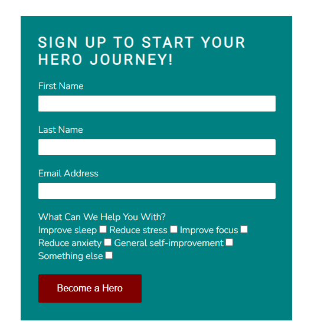

# MINDFULNESS HERO
Mindfulness Hero is a website that helps to inspire people to mediate and be more mindful. The aim of the website is to provide information on the benfits associated with mindfulness & mediation with the end goal of having people signup. 


## Features

### Existing Features

- **Navigation Bar**
    -  The navigation bar is at the very top of the page on the landing page as well as the article pages. It is identical on each page and allows for easy navigation. 
    - At the top left is the logo of MINDFULNESS HERO. On the right hand side of the navigation bar is the other navigation links which are Home, Meditate, Articles and Signup. This make everything easy and aaccessible.All of these links will bring the user to the relevant section on the landing page.


- **Landing Page Image**
    - Near the top of the webpage there is an image looking out on a peaceful ocean and beach. This gives the user a feel for what the website is all about.
    - There is a text overlay on the image letting the user know what the goal of the webiste is. This in combination with the image lets the user know that they are in a calm safe space. 


- **Reasons To Be a Hero Section**
    - The reasons to be a a hero section shows the user the benfits of becoming a part of the community as well as using mindfulness & meditation practices and the benefits they will gain overall. 
    - Once they see the benfits this should encourage the user to signup and interact more with the website. 


- **Meditate Section**
    - This is a 10 minute guided mediation. The meditation video gives the user a feel for the video content they can expect should they sign up. This should help with encouraging the user to interact with the website. 


- **Hero Stories Section**
    - The hero stories section gives a background of some of the current users of the Mindfulness Heros and what they have experienced since siging up. 
    - Once a users hears of some of the benefits that others  have experierienced this should encourage them to interact more with the website and sign up. 


- **Recent Articles Section**
    - The recent articles sections gives the user access to the some of the most recent articles posted on the site. This again gives them a feel for the type of content they can expect if they decide to sign up. 
    - Each article brings the user to a new page. They can simply close the window when they are done reading the article and continue navigating through the site from the landing page. 


- **Sign Up**
    - The sign up allows the user to get signed up to Mindfulness Heros to begin their journey and get more access to content. 
    - The signup form collects first name, last name & email address. 
    - The user also has the choice to advise why they are sigining up through a checkbox. It could be to help to Improve sleep, Reduce stress, Improve focus, Reduce anxiety, General self-improvement or other. This helps in creating a tailored signup & could assist in tailoring specific content towards certain users after signup. 



- **Footer**
    - The footer section contains the social media links for Facebook, Instagram & TikTok. This will let the user find & interact with Mindfulness Hero on social media.
    - It also contains copyright information. 


Welcome jackcomey,

This is the Code Institute student template for Gitpod. We have preinstalled all of the tools you need to get started. It's perfectly ok to use this template as the basis for your project submissions.

You can safely delete this README.md file, or change it for your own project. Please do read it at least once, though! It contains some important information about Gitpod and the extensions we use. Some of this information has been updated since the video content was created. The last update to this file was: **September 1, 2021**

## Gitpod Reminders

To run a frontend (HTML, CSS, Javascript only) application in Gitpod, in the terminal, type:

`python3 -m http.server`

A blue button should appear to click: _Make Public_,

Another blue button should appear to click: _Open Browser_.

To run a backend Python file, type `python3 app.py`, if your Python file is named `app.py` of course.

A blue button should appear to click: _Make Public_,

Another blue button should appear to click: _Open Browser_.

In Gitpod you have superuser security privileges by default. Therefore you do not need to use the `sudo` (superuser do) command in the bash terminal in any of the lessons.

To log into the Heroku toolbelt CLI:

1. Log in to your Heroku account and go to *Account Settings* in the menu under your avatar.
2. Scroll down to the *API Key* and click *Reveal*
3. Copy the key
4. In Gitpod, from the terminal, run `heroku_config`
5. Paste in your API key when asked

You can now use the `heroku` CLI program - try running `heroku apps` to confirm it works. This API key is unique and private to you so do not share it. If you accidentally make it public then you can create a new one with _Regenerate API Key_.

------

## Release History

We continually tweak and adjust this template to help give you the best experience. Here is the version history:

**September 1 2021:** Remove `PGHOSTADDR` environment variable.

**July 19 2021:** Remove `font_fix` script now that the terminal font issue is fixed.

**July 2 2021:** Remove extensions that are not available in Open VSX.

**June 30 2021:** Combined the P4 and P5 templates into one file, added the uptime script. See the FAQ at the end of this file.

**June 10 2021:** Added: `font_fix` script and alias to fix the Terminal font issue

**May 10 2021:** Added `heroku_config` script to allow Heroku API key to be stored as an environment variable.

**April 7 2021:** Upgraded the template for VS Code instead of Theia.

**October 21 2020:** Versions of the HTMLHint, Prettier, Bootstrap4 CDN and Auto Close extensions updated. The Python extension needs to stay the same version for now.

**October 08 2020:** Additional large Gitpod files (`core.mongo*` and `core.python*`) are now hidden in the Explorer, and have been added to the `.gitignore` by default.

**September 22 2020:** Gitpod occasionally creates large `core.Microsoft` files. These are now hidden in the Explorer. A `.gitignore` file has been created to make sure these files will not be committed, along with other common files.

**April 16 2020:** The template now automatically installs MySQL instead of relying on the Gitpod MySQL image. The message about a Python linter not being installed has been dealt with, and the set-up files are now hidden in the Gitpod file explorer.

**April 13 2020:** Added the _Prettier_ code beautifier extension instead of the code formatter built-in to Gitpod.

**February 2020:** The initialisation files now _do not_ auto-delete. They will remain in your project. You can safely ignore them. They just make sure that your workspace is configured correctly each time you open it. It will also prevent the Gitpod configuration popup from appearing.

**December 2019:** Added Eventyret's Bootstrap 4 extension. Type `!bscdn` in a HTML file to add the Bootstrap boilerplate. Check out the <a href="https://github.com/Eventyret/vscode-bcdn" target="_blank">README.md file at the official repo</a> for more options.

------

## FAQ about the uptime script

**Why have you added this script?**

It will help us to calculate how many running workspaces there are at any one time, which greatly helps us with cost and capacity planning. It will help us decide on the future direction of our cloud-based IDE strategy.

**How will this affect me?**

For everyday usage of Gitpod, it doesn’t have any effect at all. The script only captures the following data:

- An ID that is randomly generated each time the workspace is started.
- The current date and time
- The workspace status of “started” or “running”, which is sent every 5 minutes.

It is not possible for us or anyone else to trace the random ID back to an individual, and no personal data is being captured. It will not slow down the workspace or affect your work.

**So….?**

We want to tell you this so that we are being completely transparent about the data we collect and what we do with it.

**Can I opt out?**

Yes, you can. Since no personally identifiable information is being captured, we'd appreciate it if you let the script run; however if you are unhappy with the idea, simply run the following commands from the terminal window after creating the workspace, and this will remove the uptime script:

```
pkill uptime.sh
rm .vscode/uptime.sh
```

**Anything more?**

Yes! We'd strongly encourage you to look at the source code of the `uptime.sh` file so that you know what it's doing. As future software developers, it will be great practice to see how these shell scripts work.

---

Happy coding!
