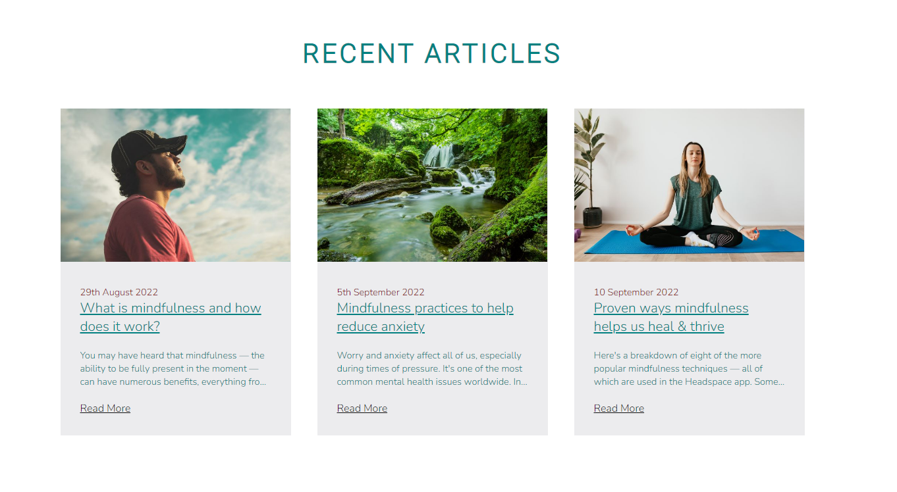
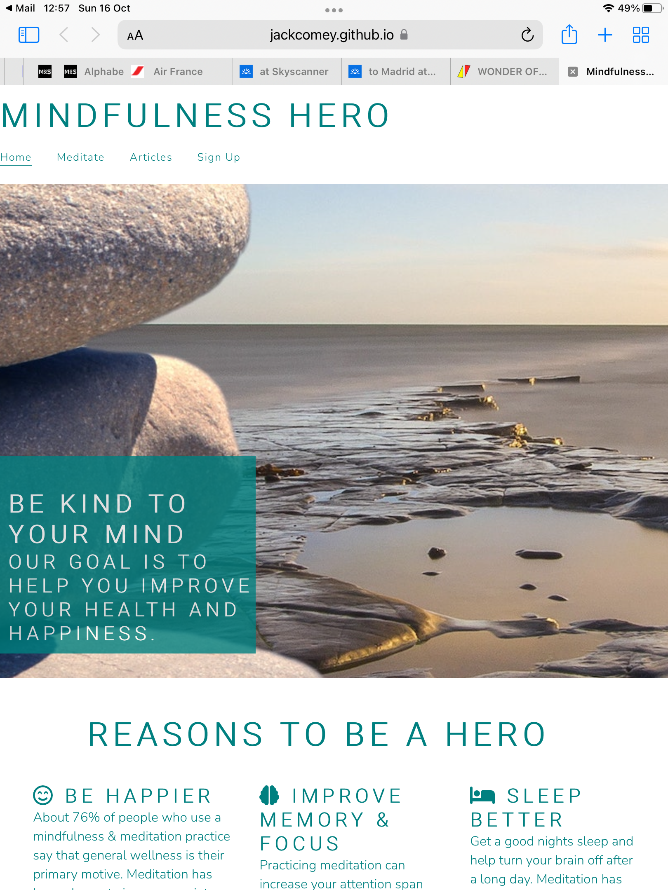

# MINDFULNESS HERO
Mindfulness Hero is a website that helps to inspire people to mediate and be more mindful. The aim of the website is to provide information on the benefits associated with mindfulness & mediation with the end goal of having people signup. 

## UX/UI
- Careful thought was put into this website to make it as attractive & as easy to navigate to the user as possible. 
- Roboto & Nunito is the font pairing used on the site. They have a simplicity to them and go quite well together. A wellness website should have simple fonts so they do not overwhelm the user. The combination was found on [fontpair](https://www.fontpair.co/all)
- I decided to go with teal as my main colour for the font & have it play a part in other elements of the website such as the icons and footer. This tone has been known to represent balance, calm, and soothing whilst also being restorative and rejuvenating – perfect for any unsettled, uncertain times which users may be experiencing if seeking out a wellness website. 
- The landing page gives the user everything they need to know about the benefits mindfulness & mediation can give their lives. There is testimonials to how the website has helped other users as well as free content with articles and a meditation video. All of this should help in getting the user invested enough to sign up for more content and become part of the community. 

## Features

### Existing Features

- **Navigation Bar**
    -  The navigation bar is at the very top of the page on the landing page as well as the article pages. It is identical on each page and allows for easy navigation. 
    - At the top left is the logo of MINDFULNESS HERO. On the right hand side of the navigation bar is the other navigation links which are Home, Meditate, Articles and Signup. This make everything easy and accessible. All of these links will bring the user to the relevant section on the landing page.

- **Landing Page Image**
    - Near the top of the webpage there is an image looking out on a peaceful ocean and beach. This gives the user a feel for what the website is all about.
    - There is a text overlay on the image letting the user know what the goal of the website is. This in combination with the image lets the user know that they are in a calm safe space. 

- **Reasons To Be a Hero Section**
    - The reasons to be a a hero section shows the user the benefits of becoming a part of the community as well as using mindfulness & meditation practices and the benefits they will gain overall. 
    - Once they see the benefits this should encourage the user to signup and interact more with the website. 

- **Meditate Section**
    - This is a 10 minute guided mediation. The meditation video gives the user a feel for the video content they can expect should they sign up. This should help with encouraging the user to interact with the website. 

- **Hero Stories Section**
    - The hero stories section gives a background of some of the current users of Mindfulness Hero and what they have experienced since signing up. 
    - Once a user hears of some of the benefits that others  have experienced this should encourage them to interact more with the website and sign up. 

- **Recent Articles Section**
    - The recent articles sections gives the user access to the some of the most recent articles posted on the site. This again gives them a feel for the type of content they can expect if they decide to sign up. 
    - Each article brings the user to a new page. They can simply close the window when they are done reading the article and continue navigating through the site from the landing page. They also have the option to navigate back to the homepage 

- **Sign Up**
    - The sign up allows the user to get signed up to Mindfulness Hero to begin their journey and get more access to content. 
    - The signup form collects first name, last name & email address. 
    - The user also has the choice to advise why they are signing up through a checkbox. It could be to help to Improve sleep, Reduce stress, Improve focus, Reduce anxiety, General self-improvement or other. This helps in creating a tailored signup & could assist in tailoring specific content towards certain users after signup. 

- **Footer**
    - The footer section contains the social media links for Facebook, Instagram & TikTok. This will let the user find & interact with Mindfulness Hero on social media.
    - It also contains copyright information. 

### Features Left to Implement
- Once a user has successfully signed up they should have acccess to a full range of articles & videos

## Testing 
- Once the site was deployed I tested it manually on various browsers - Chrome, Safari, Edge, Firefox and it was compatible on all. 
- I confirmed that the site works well and is responsive & functions in all browsers at the various different screen sizes from large to small.
- I also tested the site on various devices - android phone, iPhone, iPad and the site works & is responsive on all. 
- All of the clickable links work - the navigation links as well as the articles & signup form. 

**Examples of Screen Shots of Testing**
- Safari  on iPad portrait

- Safari  on iPad landscape

- Chrome  on Android phone

### Validator Testing
- HTML
    - No errors were returned when passing any of the HTML Pages through the W3C validator
    - [Landing Page](https://validator.w3.org/nu/?doc=https%3A%2F%2Fjackcomey.github.io%2Fmindfulness-hero%2Findex.html)
    - [What is Mindfulness Article](https://validator.w3.org/nu/?doc=https%3A%2F%2Fjackcomey.github.io%2Fmindfulness-hero%2Fmindfulness.html)
    - [Mindfulness Practices Article](https://validator.w3.org/nu/?doc=https%3A%2F%2Fjackcomey.github.io%2Fmindfulness-hero%2Fpractices.html)
    - [Proven Ways Article](https://validator.w3.org/nu/?doc=https%3A%2F%2Fjackcomey.github.io%2Fmindfulness-hero%2Fproven.html)
- CSS 
    - No errors were found when passing the CSS through the official [(Jigsaw) Validator](https://jigsaw.w3.org/css-validator/validator?uri=https%3A%2F%2Fjackcomey.github.io%2Fmindfulness-hero%2Fassets%2Fcss%2Fstyle.css&profile=css3svg&usermedium=all&warning=1&vextwarning=&lang=en)
- Accessibility
    - I tested the site through Lighthouse in devtools to ensure that it was accessible and best practices were being followed. 

## Bugs & Unfixed Bugs
- There were no bugs when the site was deployed so therefore no fixes required. 

## Deployment 
- **Cloning/Forking**
    - To clone or fork the project go to the top of the repository & click on the cloning button. 
    - Or from the code drop down choose to download a zip file containing the code or use the Git link to manually clone. 

- **Local Deployment**
    - Navigate to [Gitpod.io](https://gitpod.io/) and create an account. 
    - Download & install the appropriate extension for the browser of your choice. 
    - Return to this repository and click on the green Gitpod button. This will open the code in a new workspace. 

- **Remote Deployment**
    - The site was deployed to GitHub pages. The steps to deploy were the below:
    - In the GitHub repository go to the Settings tab. 
    - Click on pages tab on the left hand side.  
    - From sources click the drop down & select Main Branch. 
    - Once the main branch has been selected, the page will be refreshed with a detailed ribbon display to indicate the successful deployment. The page provided the link to the completed website. 

The live link can be found here - (https://jackcomey.github.io/mindfulness-hero/index.html)

## Credits

**Content**
- Navigation bar, hero image section and signup sections were inspired by the [Love Running](https://learn.codeinstitute.net/courses/course-v1:CodeInstitute+LR101+2021_T1/courseware/4a07c57382724cfda5834497317f24d5/f2db5fd401004fccb43b01a6066a5333/) project. Parts of the code were used again for this. 
- Reasons to be a hero, hero stories section and recent articles sections all have flex elements in it which required quite a bit of research outside of the course content to help the website be more responsive. The 2 videos used for this were from [Kevin Powell](https://www.youtube.com/watch?v=u044iM9xsWU&t=1481s) and [Going-To Internet](https://www.youtube.com/watch?v=WVOmmc0UTiM)
- Facts for reason to be a hero found on [disturbmenot](https://disturbmenot.co/meditation-statistics/#:~:text=The%20Top%20Mind%2DBlowing%20Meditation,for%20coronary%20disease%20by%2087%25)
- Proven ways mindfulness helps us heal & thrive article from [mindful.org](https://www.mindful.org/the-science-of-mindfulness/)
- Mindfulness practices to help reduce anxiety article from [Calm](https://blog.calm.com/blog/5-mindfulness-practices-to-help-reduce-anxiety)
- What is mindfulness and how does it work article from [Headspace](https://www.headspace.com/mindfulness/mindfulness-101)
- All icons on the site from [Font Awesome](https://fontawesome.com/)
- The footer is from the [Coders Coffeehouse](https://fontawesome.com/) 

**Media**
- All images on the site are from the open source website [Pexels](https://www.pexels.com/)
- The mediation video is from [YouTube](https://www.youtube.com/)
